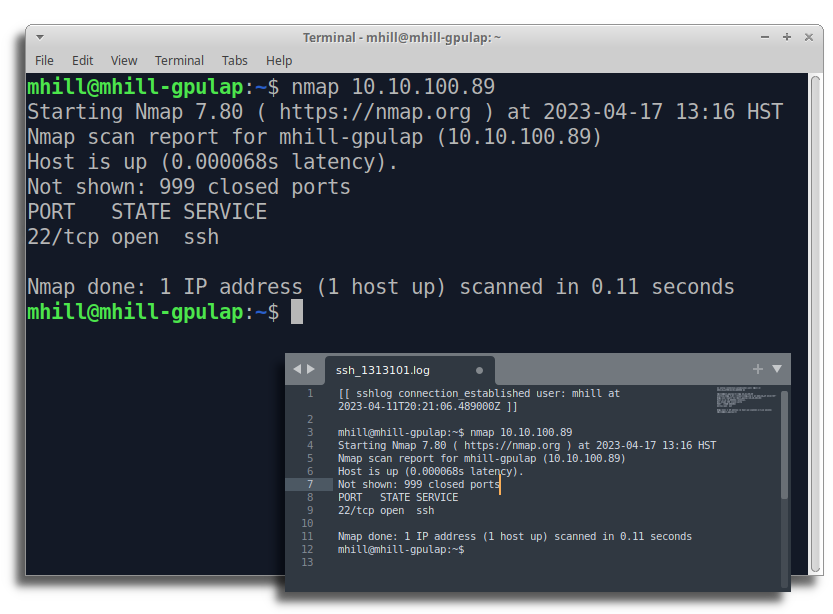
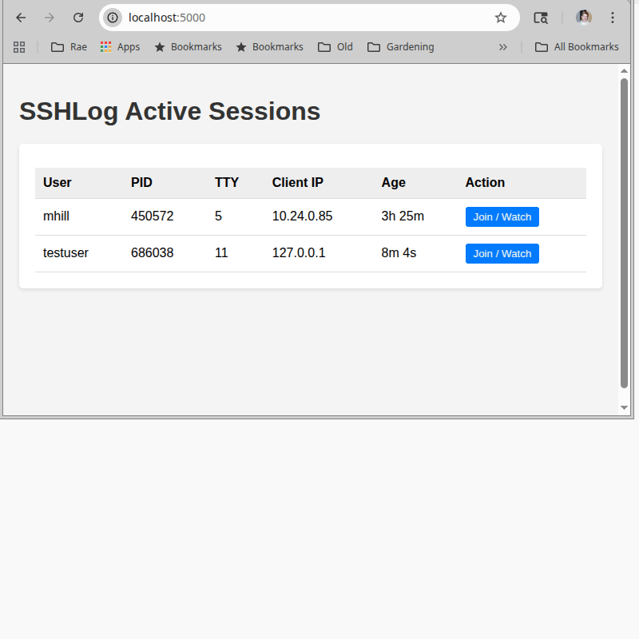

# sshlog

SSHLog is a free, source-available Linux daemon written in C++ and Python that passively monitors OpenSSH servers via eBPF to:

  - **Record all SSH session activity** (commands and output) to log files for any connecting user
  - Allow administrators to **share an SSH session** with any logged in user
  - Watch SSH sessions and **post Slack messages** or run arbitrary commands when specific activity occurs
  - Forward all SSH events to a **remote syslog server**
  - Send **statsd metrics** to track user logins, disconnects, command activity, etc.
  - Configurable/Extendable **plug-in architecture** to execute custom actions triggered by SSH activity


SSHLog is configurable, any combination of features may be enabled, disabled, or customized.  It works with your existing OpenSSH server process, no alternative SSH daemon is required.  Just install the sshlog package to begin monitoring SSH.

 

## Quick Start (Docker)

SSHLog is designed to run as a privileged Docker container.

### 1. Try it out (Diagnostic Mode)

To quickly test SSHLog with the web interface and session injection enabled, run:

```bash
docker run --privileged \
  -e SSHLOG_ENABLE_DIAGNOSTIC_WEB=1 \
  -e SSHLOG_ENABLE_SESSION_INJECTION=1 \
  -v /usr/src:/usr/src:ro \
  -v /lib/modules:/lib/modules:ro \
  -v /var/log/btmp:/var/log/btmp:ro \
  -v /etc/passwd:/etc/passwd:ro \
  -v /etc/group:/etc/group:ro \
  -v /dev/pts:/dev/pts:rw \
  -v /sys/kernel/debug:/sys/kernel/debug:rw \
  -v /etc/sshlog:/etc/sshlog \
  --net=host --pid=host \
  --rm -it ghcr.io/sshlog/agent:v1.1.0
```

**Note:** This mode enables the diagnostic web server on port 5000 and allows writing to SSH sessions.

### 2. Web Interface

Once running, access the dashboard at `http://<server-ip>:5000`.



### 3. CLI Usage

You can interact with the daemon via the CLI app inside the container:

#### Show current logged in sessions:

    docker exec -it sshlog sshlog sessions
      
     User        Last Activity             Last Command               Session Start              Client IP           TTY
    mhill           just now              /usr/bin/gcc             2023-04-10 16:16:18        127.0.0.1:58668         17
    billy          10 min ago            /usr/sbin/fdisk           2023-04-10 12:11:05        15.12.5.8:58669         32


#### Monitor real-time SSH activity

    docker exec -it sshlog sshlog watch
    
    16:16:45 connection_established (970236) billy from ip 15.12.5.8:59120 tty 33
    16:16:45 command_start          (970236) billy executed /bin/bash
    ...

#### Attach to another user's shell session (either read-only or interactive)

    docker exec -it sshlog sshlog attach [TTY ID]

## Production Deployment

For production use, we recommend locking down the container:
*   Disable the web server (remove `SSHLOG_ENABLE_DIAGNOSTIC_WEB`)
*   Disable session injection (remove `SSHLOG_ENABLE_SESSION_INJECTION`)
*   Mount `/dev/pts` as read-only

```bash
docker run -d --restart=always --name sshlog \
  --privileged \
  -v /usr/src:/usr/src:ro \
  -v /lib/modules:/lib/modules:ro \
  -v /var/log/btmp:/var/log/btmp:ro \
  -v /etc/passwd:/etc/passwd:ro \
  -v /etc/group:/etc/group:ro \
  -v /dev/pts:/dev/pts:ro \
  -v /sys/kernel/debug:/sys/kernel/debug:rw \
  -v /var/log/sshlog:/var/log/sshlog \
  -v /etc/sshlog:/etc/sshlog \
  --net=host --pid=host \
  ghcr.io/sshlog/agent:v1.1.0
```

## Security Implications

**Warning:** This container requires `--privileged` mode and `--pid=host` to monitor SSH processes via eBPF. This grants the container significant access to the host system.

When `SSHLOG_ENABLE_SESSION_INJECTION` is enabled, the container has the ability to inject keystrokes into any active SSH session on the host. Ensure access to this container and the Docker socket is strictly controlled.


## Configuration

The configuration files can be customized to trigger any number of actions based on configurable conditions.  For example:

  - Send a Slack message when an SSH login succeeds or fails
  - Trigger a script if anyone runs the "nmap" command.
  - Send an e-mail if a particular username uploads a file via scp

Active configurations are located in /etc/sshlog/conf.d/

Sample configurations for reference are located in /etc/sshlog/samples/ 

Detailed configuration documentation is available in the [daemon/config_samples/](daemon/config_samples/) folder


## Custom Plug-ins

SSHLog plug-in architecture supports running custom Python code to filter and act upon SSH events.  These plug-ins have full access to the SSH data and are triggered in real-time.  In fact, all of the core functionality available in SSHLog uses this same plug-in architecture.

To create your own plug-ins, follow along with the [documentation and tutorial  ](daemon/plugins/readme.md)


## Requirements

  - \*Linux Kernel 5.4 or higher (released Nov 2019)
  - OpenSSH server 1.8.1 or higher

\*SSHLog uses eBPF filters to monitor OpenSSH passively.  This technique requires a minimum Linux kernel version in order to function

Older versions of OpenSSH Server may work correctly, however it has not been tested
